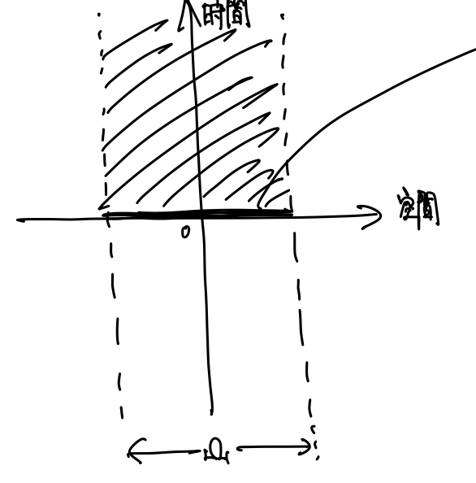
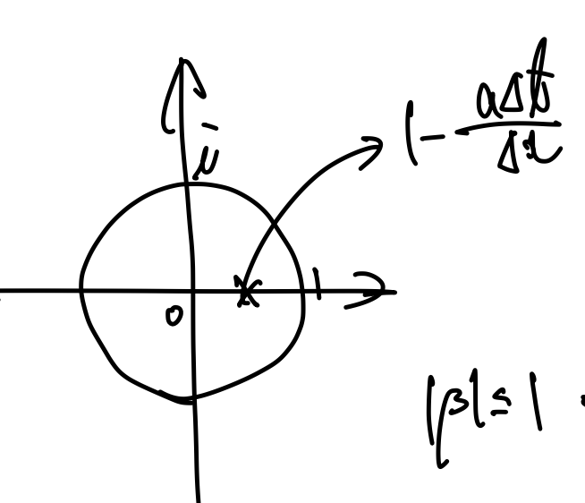
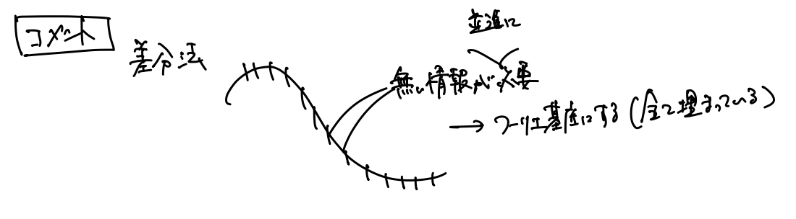

# 連続系アルゴリズム 
- 担当: 吉本さん

# 時間発展の偏微分方程式 
多次元のグラフの動き・動く変数が多い
## 問題設定
領域$\Omega$の中で「解=多次元のグラフの時間発展」が一意に定まる-> \
初期条件(=ある時刻でのグラフの形)と各時刻の境界条件が必要

## 拡散方程式
$v$: 拡散定数として
$$
\begin{aligned}
\frac{\partial u}{\partial t} &= v\frac{\partial^2 u}{\partial x^2} \  (一次元) \tag{1} \\
\frac{\partial u}{\partial t} &= v(\frac{\partial^2 u}{\partial x^2} + \frac{\partial^2 u}{\partial y^2} + \frac{\partial^2 u}{\partial z^2}) \  (二次元)
\end{aligned}
$$

- 初期条件
$$
u(x, t=0)= a(x)
$$

- 境界条件\
  $\Omega$が一次元で区間(0, 1)とする
  1. 第一種境界条件 (Direchlet条件)\
    境界でのuの値を決める $u(0, t)= b_0(t)s$\
    例: 熱なら境界で温度固定

  2. 第二種境界条件 (Newmann条件)\
      グラフの勾配の境界に直交する成分を決める\
      $$
        \frac{\partial u}{\partial x}(0,t) = c_0(t)\\
        \frac{\partial u}{\partial x}(1,t) = c_1(t)
      $$
      例: $c_0 = c_1 = 0$: 境界で断熱

- 数値解のグラフ表現方法\
  空間を格子で離散化する 格子点$x_i \rightarrow u(x_i,t)$ \
  u(x,t)についての多元の常微分方程式として解く「線の方法」\
  一つの$u(x,t) \rightarrow$ 時間発展が世界線一本

  $\Delta x$を格子間隔として、
  $$
  x_i = \Delta x \times i\\
  u_i(t) = u(x_i, t)
  $$

  - 右辺の表現: 差分表現
    テイラー展開より
    $$
      u(x_{i\pm 1},t) = u(x_i, t) \pm \Delta x  \frac{\partial u}{\partial x}(x_i,t) + \frac {{\Delta x}^2} {2} \frac{\partial^2 u}{\partial x^2}(x_i,t) \pm \frac {{\Delta x}^3} {6} \frac{\partial^3 u}{\partial x^3}(x_i,t) + O({\Delta x}^4)
    $$
    以上の$\pm$の2式を足して、
    $$
      u(x_{i+1},t) +  u(x_{i-1},t)= 2u(x_i, t) +  {\Delta x}^2 \frac{\partial^2 u}{\partial x^2}(x_i,t) + O({\Delta x}^4)
    $$
    よって、
    $$
      \frac{\partial^2 u}{\partial x^2}(x_i,t) = \frac { u(x_{i+1},t) +  u(x_{i-1},t) - 2u(x_i, t) }{{\Delta x}^2 } + O({\Delta x}^2 )
    $$
    式(1)に代入して、
    $$
      \frac {\partial u_i}{\partial t}= \frac { u(x_{i+1},t) +  u(x_{i-1},t) - 2u(x_i, t) }{{\Delta x}^2 } + O({\Delta x}^2 ) 
      \tag{2}
    $$
    この式を解く    

- 前進法 (陽解法)
  $$
    \frac {\partial u_i}{\partial t}= \frac {u_i^{k+1} -  u_i^{k}}{\Delta t } \\
    u_i^k = u_i{t_k} = u_i(k\Delta t)
  $$
  として、式(2)に代入して整理
  $$
    u_i^{k+1}= u_i^k + \frac {v \Delta t}{\Delta x^2} \{ u_{i-1}^k + u_{i+1}^k - 2u_i^k \}
  $$
  $r = \frac {v \Delta t}{\Delta x^2}$ として
  $$
    u_i^{k+1}= u_i^k + r ( u_{i-1}^k + u_{i+1}^k - 2u_i^k )
    \tag{3}
  $$
- 後退法 (陰解法)
  $$
    \frac {\partial u_i}{\partial t}= \frac {u_i^k -  u_i^{k-1}}{\Delta t } 
  $$
  として、式(2)に代入して整理
  $$
  \begin{aligned}
    \frac{u_i^k- u_i^{k-1}}{\Delta t} &= v \frac{u_{i-1}^k + u_{i+1}^k - 2u_i^k}{\Delta x^2}\\
    u_i^k -  u_i^{k-1} &= r( u_{i-1}^k + u_{i+1}^k - 2u_i^k )\\
    u_i^{k-1} &= -r u_{i-1}^k +(1+2r)u_i^k -r u_{i+1}^k \\ \\ \\ \\ \tag{4}
  \end{aligned}
  $$
  注: 二次元の場合、係数行列は三重対角行列なので、$O(n^2)$で解ける

## 解の安定性
$\Delta x, \Delta t$の組み合わせで不安定になることがある。
### von Neuwmann(フォンノイマン)の安定性解析
線形の問題 解の基底を考える
- 並進対称性\
  j: 空間方向格子点のindex\
  k: 時間方向格子点のidex\
  $\alpha$: 波数(任意)\
  $i$: 虚数単位\
  $\beta$: 増幅係数として\
  空間方向は$\propto e^{i\alpha j}$の形
  $$
  u_j^k = C e^{i\alpha j}\beta^k 
  \tag{5}
  $$
  の形を考えて、前進/後退 Eulerの式に代入して$\beta, r, \alpha$の関係式を得る

    - 前進法\
      式(3)に式(5)を代入して整理
      $$
      \begin{aligned}
        \beta &= 1 +r(e^{-i\alpha} + e^{i\alpha}  -2)\\
        \beta &= 1 +2r(\cos \alpha  -1)\\
        \beta &= 2r \cos \alpha + (1-2r)
      \end{aligned}
      $$
      $\alpha$が任意より
      $$
        \therefore 1-4r \leq \beta \leq 1
      $$
      安定である条件は  $|\beta| \leq 1 \ (\because k \rightarrow \infty で\beta^kが発散しないようにするため)$
      $$
        \Leftrightarrow -1 \leq 1-4r \leq 1\\
        \Leftrightarrow  0 \leq r \leq \frac 1 2
      $$

      $r = \frac {v \Delta t}{\Delta x^2} \leq \frac 1 2$ となるように$\Delta x, \Delta t$を取る必要がある\
      rの値を一定に保つなら$\Delta x, \Delta t$は独立に取れない

    - 後退法\
      式(4)に式(5)を代入
      $$
      \begin{aligned}
        \beta^{-1} &= 1 + r(2 - e^{-i\alpha} -  e^{i\alpha})\\
        \beta^{-1} &= 1 + 2r(1 - \cos \alpha )\\
        \beta &= \frac{1}{1 + 2r(1 - \cos \alpha )}
      \end{aligned}\\
      \forall \alpha, |\beta| \leq 1 だから無条件で安定
      $$
    
### 解法の選択
|目的 |陽解法| 陰解法 |
|----|---- |----|
|可能な$\Delta t$を大きくする| ×| ⚪︎|
|少ない演算量で実装する| ⚪︎　| ×|

## 時間方向ニ次精度 -Crank-Nicolson法-
$$
\begin{aligned}
u(x_i, t +  \Delta t) &= u (x_i, t+\frac 1 2 \Delta t) + \frac {\Delta t}{2}\frac {\partial u}{\partial t}(x_i, t+ \frac 1 2 \Delta t) + \frac 1 {2!}\left(\frac {\Delta t}{2} \right)^2\frac {\partial^2 u}{\partial t^2}(x_i,t+ \frac 1 2 \Delta t) + O(\Delta t^3) \\

u(x_i, t) &= u (x_i, t+\frac 1 2 \Delta t) - \frac {\Delta t}{2}\frac {\partial u}{\partial t}(x_i,t+\frac 1 2 \Delta t) + \frac 1 {2!}\left(\frac {\Delta t}{2} \right)^2\frac {\partial^2 u}{\partial t^2}(x_i,t+ \frac 1 2 \Delta t) + O(\Delta t^3)
\end{aligned}
$$
差をとって整理
$$
  \frac{ u(x_i, t +  \Delta t) - u(x_i, t)}{\Delta t} = \frac {\partial u}{\partial t}(x_i,t+\frac 1 2 \Delta t) + O(\Delta t^2)
$$
式(1)に代入して
$$
\begin{aligned}
  \frac {u(x_i, t+ \Delta t) - u(x_i, t)}{\Delta t} &= v \frac {\partial^2 u}{\partial x^2}(x_i,t+\frac 1 2 \Delta t) + O(\Delta t^2) \\
  &\sim \frac v 2 \left( \frac {\partial^2 u}{\partial x^2}(x_i,t) + \frac {\partial^2 u}{\partial x^2}(x_i,t+\Delta t) \right)+ O(\Delta t^2)
\end{aligned}
$$
よって
$$
\begin{aligned}
  \frac{u_i^{k+1}-u_i^k} {\Delta t }
  = \frac v 2 \left(\frac{u_{i+1}^{k+1}+u_{i-1}^{k+1}-2u_i^{k+1}}{\Delta x^2} + \frac{u_{i+1}^{k}+u_{i-1}^{k}-2u_i^{k}}{\Delta x^2} \right)+O(\Delta x^2)+ O(\Delta t^2)\\
\end{aligned}
$$
- von Neumann解析:\
  $u_j^k = c e^{i\alpha j}\beta^k$を代入すると、
  $$
    \beta = \frac{1-r(1-\cos \alpha)}{1+r(1-\cos \alpha)}\\
    \forall \alpha, |\beta| \leq 1だから安定
  $$

## 移流方程式
$$
  \frac{\partial u}{\partial t} + a\frac{\partial u}{\partial x} = 0 \tag{6}
$$
解は$u = f(x-a t)$\
$0 < a$の時、情報は$+x$の方向に流れる。\
上流側 -> 下流側で決まる

- 二次精度中心差分 
  $$
  \frac {\partial u}{\partial x}(x_i) = \frac{u(x_{i+1})- u(x_{i-1})}{2\Delta x} + O(\Delta x^2)
  $$
  式(6)に代入して、
  $$
  \frac {u_i^{k+1} - u_i^k}{\Delta t} = -a\frac{u_{i+1}^k- u_{i-1}^k}{2\Delta x}
  \tag{7}
  $$

- 一次精度風上差分
  $$
  \alpha > 0 \Rightarrow \frac {\partial u}{\partial x}(x_i) = \frac{u(x_{i})- u(x_{i-1})}{\Delta x}  + O(\Delta x) \\

  \alpha < 0 \Rightarrow \frac {\partial u}{\partial x}(x_i) = \frac{u(x_{i+1})- u(x_{i})}{\Delta x}  + O(\Delta x)
  $$
  式(6)に代入して、
  $$
  \frac {u_i^{k+1} - u_i^k}{\Delta t} = -a\frac{u_{i}^k- u_{i-1}^k}{\Delta x} 
  \tag{8}
  $$

- von Neuwmann 解析\
  $u_j^k = C e^{i\alpha j} \beta^k$ とする

  - 二次精度風上\
  式(7)に代入して
  $$
  \beta =1- i\frac{a \Delta t 
  }{\Delta x}\sin \alpha \\
  \forall \alpha, |\beta| \leq 1 よって安定
  $$

  - 一次精度風上\
    式(8)に代入
    $$
    \begin{aligned}
    \beta &= 1 - \frac{a \Delta t}{\Delta x} (1-e^{-i\alpha})\\
    \beta &= \left(1- \frac {\alpha \Delta t}{\Delta x}\right) + \frac {\alpha \Delta t}{\Delta x} e^{-i\alpha}
    \end{aligned}
    $$
    下図より 
    $$
    \begin{aligned}
    |\beta| \leq 1 &\Leftrightarrow \frac {a\Delta t}{\Delta x} \leq 1 \\&\Leftrightarrow a \leq \frac {\Delta x}{\Delta t} \\ \\ \tag{9}
    \end{aligned} 
    $$
    

  -  CFL条件\
    式(9)で$a$は物理的な流れの速度, $\frac {\Delta x}{\Delta t}$は$\Delta t$ごとに$\Delta x$だけ情報が伝わる、アルゴリズム的伝達速度を示す\
    すなわち、式(9)は、アルゴリズム的伝達速度は物理的速度以上でなければならないということを意味し、これをCFL条件という。
  
  - 一方、陰解法で解く場合、次の時刻での$u$は現在の時刻での$u$全てから計算するため、伝達速度$
  \infty$と考えられる?!

- コメント
